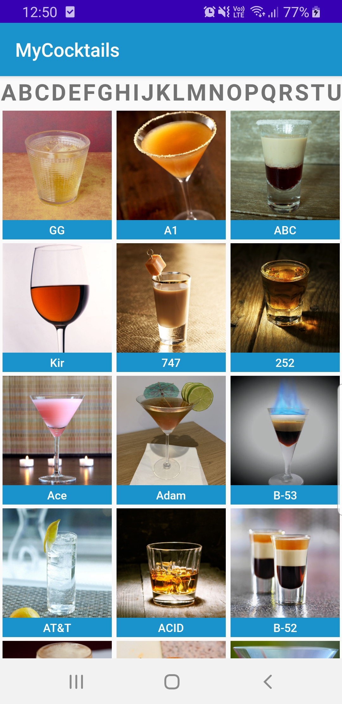
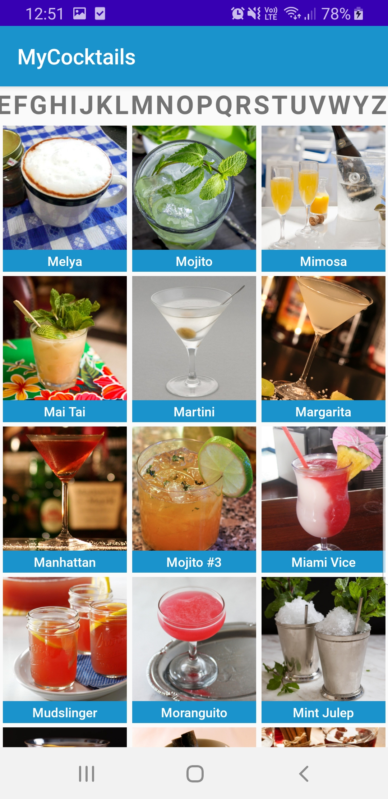
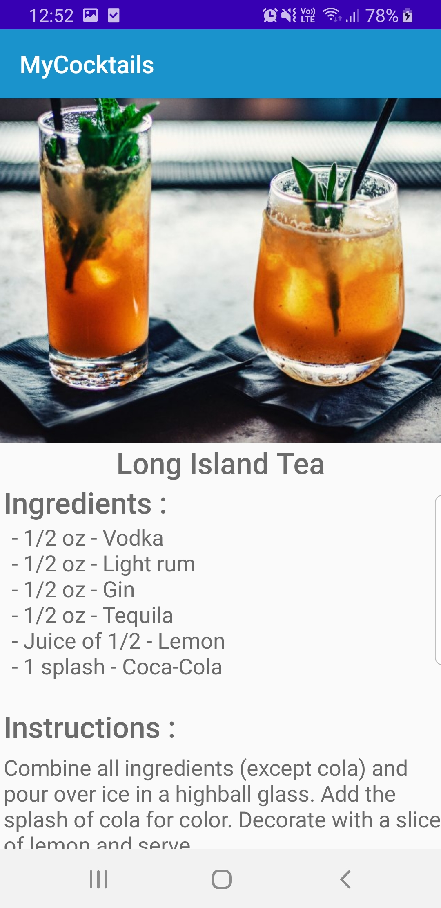
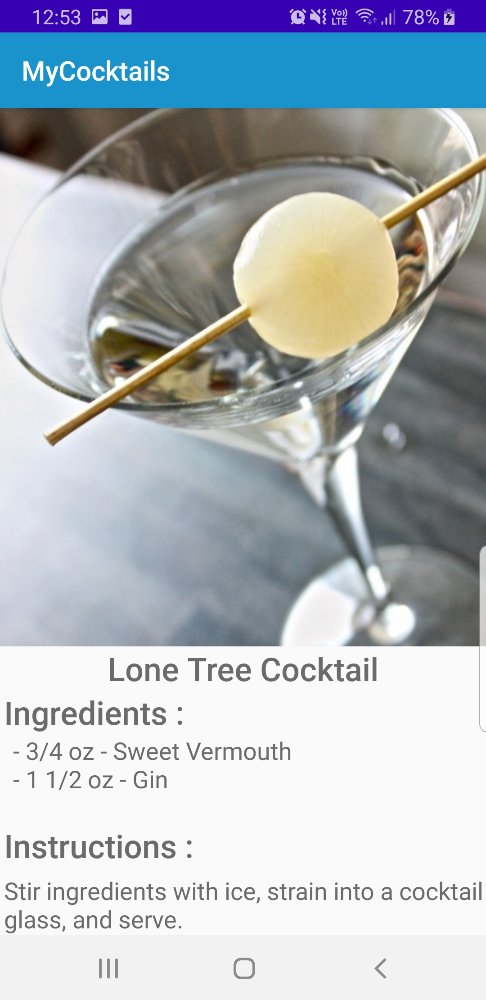

# MyCocktails App

## Presentation

This project demonstrate the use of Google's recommended pattern to design apps : MVVM.
The code is written exclusively in Kotlin supporting the latests features provided by Google's JetPack Library. 

This app lets you explore cocktails recipes through a user friendly interface using cards to present the cocktails. You can also filter
the list of cocktails displayed by the first letter, thanks to a carousel of letters at the top. 

## Instructions followed :

- MVVM & clean architecture
- REST queries
- Screens : 1 activity, 2 fragments
- Display a list of coktails through a RecyclerView
- Display the details and recipe of a cocktail 
- Basic Gitflow
- Additional features :
	- Filters by first letter with an horizontal RecyclerView
	- Use of HTML formatting to display the list of ingredients
	- Animations on various events 
	- Kotlin coroutines to handle network calls
	- DataBinding 
	
## Features :

### Home Screen :

- Displays the list of 25 cocktails (limited by the API) and the letters to filter.

 

- Home screen filtered by the letter M

### Detail Screen : 

- Displays the recipe of the selected cocktail with a larger image in a scrollable view

 

